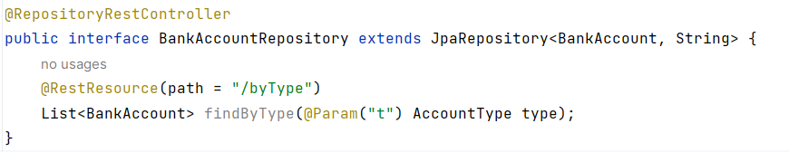
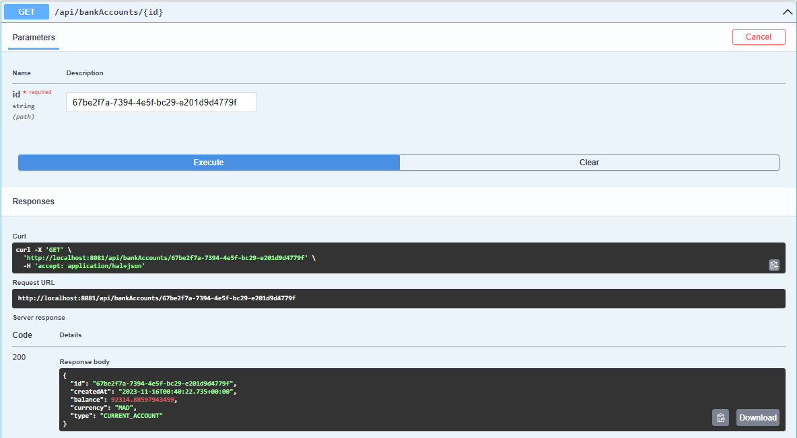
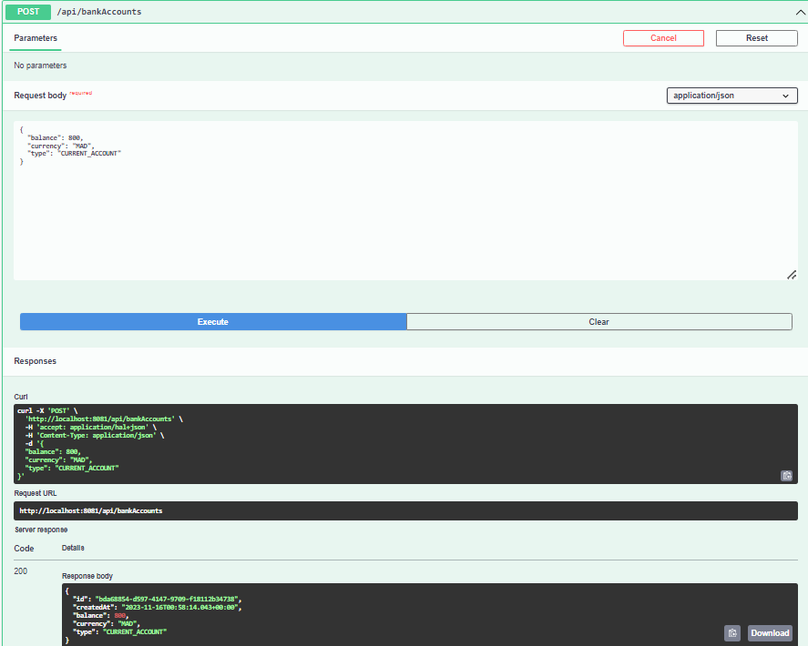

# 2. Créer l'entité JPA Compte:

# 3. Créer l'interface CompteRepository basée sur Spring Data

# 4. Tester la couche DAO

# 5. Créer le Web service Restfull qui permet de gérer des comptes

### AccountRestController:

### AccountServiceImpl

# 6. Tester le web micro-service en utilisant un client REST comme Postman
# 7. Générer et tester le documentation Swagger de des API Rest du Web service
### Swagger Interface:

#### Get bankAccounts:

#### Get Accout by id:

#### Create a bank Account:

#### Delete a bank account:

# 8. Exposer une API Restful en utilisant Spring Data Rest en exploitant des projections

# 9. Créer les DTOs et Mappers

## DTOs
### BankAccountRequestDTO:

### BankAccountResponceDTO:

## Mappers:

### AccountMapper:

# 10. Créer la couche Service (métier) et du micro service

# 11. Créer un Web service GraphQL pour ce Micro-service en utilisant cette vidéo comme suppor

## BankAccountGraphQLController:

## Schema.graphqls

## Query Test

